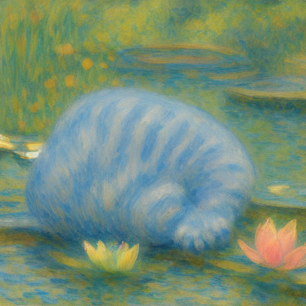
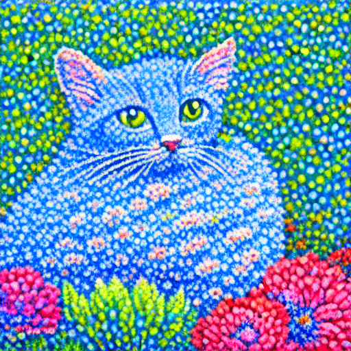
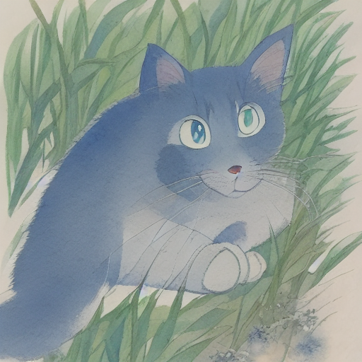

# Clover Image Tiny LoRA Trainer

Train compact visual styles for
[`neonforestmist/Clover-Image-Tiny`](https://huggingface.co/neonforestmist/Clover-Image-Tiny)
from a browser-based local control room or the command line.

The base model stays shared. A finished rank-16 style is a small
`safetensors` file; the iOS release loads that file into the stateful Core ML
U-Net at runtime instead of downloading another 648 MB U-Net.

## Published styles

| Style | Dataset | Trigger phrase | Steps | Core ML style file |
|---|---|---|---:|---|
| Monet | [`GPT_Monet_Style_Images`](https://huggingface.co/datasets/neonforestmist/GPT_Monet_Style_Images) | `Monet Style` | 1,000 | [`Monet.safetensors`](https://huggingface.co/neonforestmist/clover-image-tiny-monet-lora-coreml) |
| Pointillism | [`GPT_Pointillism_Style_Images`](https://huggingface.co/datasets/neonforestmist/GPT_Pointillism_Style_Images) | `pointillism painting` | 700 | [`Pointillism.safetensors`](https://huggingface.co/neonforestmist/clover-image-tiny-pointillism-lora-coreml) |
| Watercolor Anime | [`GPT_Watercolor_Anime_Style_Images`](https://huggingface.co/datasets/neonforestmist/GPT_Watercolor_Anime_Style_Images) | `watercolor anime` | 1,200 | [`Watercolor-Anime.safetensors`](https://huggingface.co/neonforestmist/clover-image-tiny-watercolor-anime-lora-coreml) |

All three use the official Diffusers 0.39.0 text-to-image LoRA trainer. The
U-Net attention layers are trained at rank 16; the text encoder and VAE stay
frozen.

## Examples

| Monet | Pointillism | Watercolor Anime |
|:---:|:---:|:---:|
|  |  |  |

## Setup

Use Python 3.11 or 3.12. Install the PyTorch build for your CUDA, ROCm, Apple
Silicon, or CPU environment first, then install the remaining dependencies.

```bash
python3.11 -m venv .venv
source .venv/bin/activate
pip install -r requirements.txt
```

Log in only when the dataset is private or the result should be pushed:

```bash
hf auth login
```

A CUDA GPU with at least 8 GB of memory is recommended. Apple Silicon and CPU
are useful for the five-step smoke test but are much slower for a full run.

## Local trainer GUI

Start the control room:

```bash
python trainer_gui.py
```

Open `http://127.0.0.1:7860`. The GUI lets you:

- load any included style preset and edit its dataset, trigger, step count,
  rank, learning rate, batch settings, seed, and output location;
- stream a preview of a Hub dataset or inspect a local imagefolder;
- inspect the exact `accelerate` command before starting;
- run a safe five-step smoke test or full training;
- follow step progress, logs, and generated validation samples;
- stop the local training process.

The GUI listens on localhost by default. Pass `--share` only if you
intentionally want Gradio to create a temporary public link.

## Command-line training

The CLI and GUI use the same `train_lora.py` wrapper and style configs.

```bash
# Show the exact command without downloading or training.
python train_lora.py configs/monet.json --dry-run

# Five steps on four samples; no Hub push.
python train_lora.py configs/monet.json --smoke

# Full run. The LoRA is written under outputs/.
python train_lora.py configs/monet.json

# Full run followed by a Hub upload.
python train_lora.py configs/monet.json --push-to-hub
```

Use `configs/pointillism.json` or `configs/watercolor-anime.json` for the other
published styles.

## Dataset format

A local dataset is a Diffusers imagefolder: an `images/` directory beside a
`metadata.jsonl` file. Each line pairs one image with one caption.

```text
data/example-monet/
├── images/
│   ├── gpt_monet_0001.png
│   ├── gpt_monet_0002.png
│   └── gpt_monet_0003.png
└── metadata.jsonl
```

```json
{"file_name": "images/gpt_monet_0001.png", "text": "Monet Style, a bakery interior with warm light"}
```

Start each caption with the style's consistent trigger phrase, describe the
subject after it, and use clean square images at least 512×512. A focused set
of 50–150 consistent pairs is a useful starting point.

Validate a local dataset before training:

```bash
python prepare_dataset.py data/example-monet --trigger "Monet Style"
```

To use local data, copy a config and set its `dataset` field to the imagefolder
path. `train_lora.py` automatically switches from `--dataset_name` to
`--train_data_dir`.

## Use a trained style in Diffusers

Training writes `pytorch_lora_weights.safetensors`. The technical term in
Diffusers is a LoRA adapter, but published files should use the human-facing
style name.

```python
import torch
from diffusers import DiffusionPipeline

pipe = DiffusionPipeline.from_pretrained(
    "neonforestmist/Clover-Image-Tiny",
    torch_dtype=torch.float16,
).to("cuda")  # or "mps"
pipe.load_lora_weights("outputs/monet-lora")

image = pipe(
    "Monet Style, a small blue cat beside a lily pond",
    num_inference_steps=20,
    guidance_scale=7.5,
).images[0]
image.save("sample.png")
```

## Core ML for iPhone

The current iOS architecture uses one approximately 1.5 GB shared Core ML
pipeline. Its U-Net contains 144 iOS 18 `MLState` buffers for LoRA weights.
Selecting a style writes the named roughly 6.9 MB `safetensors` file into those
buffers. It does not download or swap another full U-Net.

The older fused conversion remains in this repository only as a legacy tool.
For the current stateful export and validation workflow, see
[`coreml/README.md`](coreml/README.md).

## Repository layout

```text
clover-lora-training/
├── trainer_gui.py         # local Gradio training control room
├── train_lora.py          # reproducible Diffusers trainer wrapper
├── prepare_dataset.py     # image/caption validation
├── configs/               # published style presets
├── data/                  # format guide and a small example
└── coreml/                # stateful iOS 18 and legacy Core ML export tools
```

## Reproducibility

Each config records its dataset, hyperparameters, trigger, and seed
(`20260730`). `train_lora.py` pins the official trainer to Diffusers `v0.39.0`.
Hardware and low-level kernels can still produce small numerical differences.

## Licensing

- Code in this repository: Apache-2.0; see [`LICENSE`](LICENSE).
- Trained style weights: derivatives of Clover Image Tiny under CreativeML
  Open RAIL-M.
- The linked GPT-generated style datasets: Apache-2.0.

Generated content can inherit limitations and biases from the base checkpoint
and training data. Review outputs before use.
