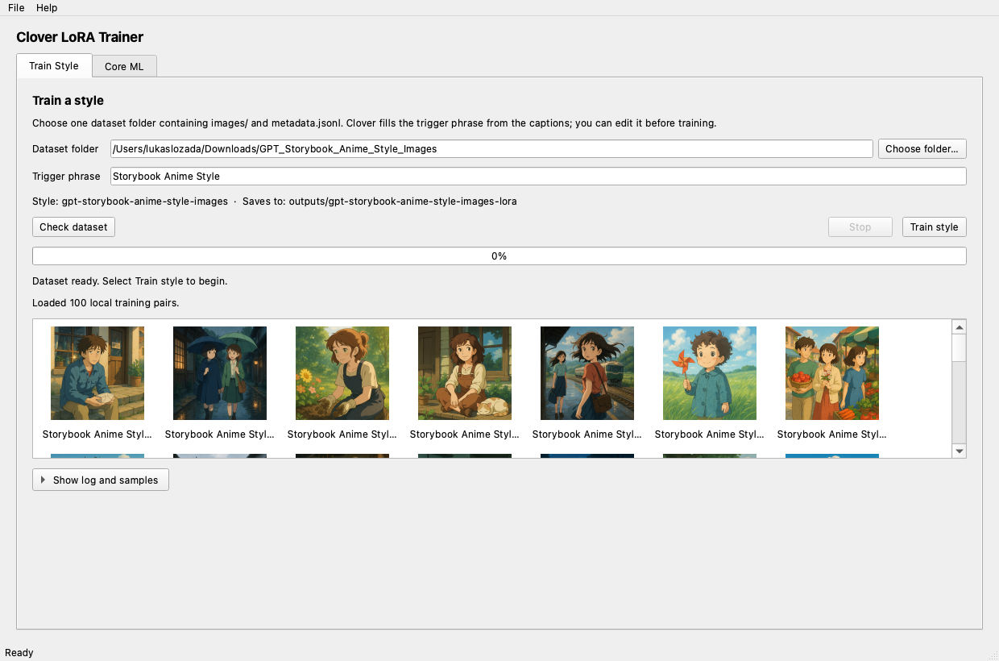
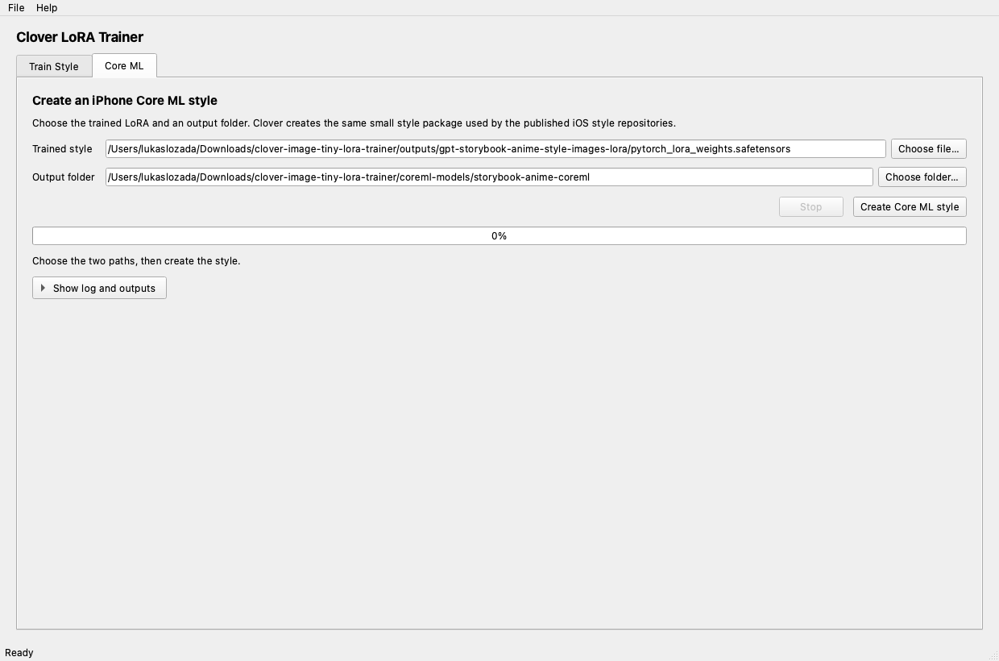

# Clover Image Tiny LoRA Trainer

A native Python desktop application for training compact style LoRAs for
[`neonforestmist/Clover-Image-Tiny`](https://huggingface.co/neonforestmist/Clover-Image-Tiny)
and packaging those styles for Clover's shared stateful Core ML U-Net.

The interface is built with Qt through PySide6. It opens as an ordinary desktop
window, uses the operating system's standard controls and file pickers, and does
not start a web server or open a browser.

The base model stays shared. A rank-16 style is roughly 6.9 MB and remains a
normal `.safetensors` file; the iOS app loads it into 144 Core ML state tensors
instead of downloading another roughly 648 MB U-Net.

<p align="center">
  
</p>

## Start the desktop app

Training and Core ML style packaging work on macOS and Windows with Python
3.11 or 3.12.
The commands below use Python 3.11; substitute 3.12 in the versioned command if
that is the version you installed.

### macOS

Install [Python 3.11 or 3.12](https://www.python.org/downloads/macos/) and
[Git](https://git-scm.com/download/mac). Open **Terminal**, then run:

```bash
git clone https://github.com/neonforestmist/clover-image-tiny-lora-trainer.git
cd clover-image-tiny-lora-trainer

python3.11 -m venv .venv
source .venv/bin/activate
python -m pip install --upgrade pip
python -m pip install torch torchvision
python -m pip install -r requirements.txt

python trainer_gui.py
```

The standard PyTorch package supports Apple Silicon through MPS.

### Windows

Install [Python 3.11 or 3.12](https://www.python.org/downloads/windows/) and
[Git](https://git-scm.com/download/win), then open **PowerShell** and run:

```powershell
git clone https://github.com/neonforestmist/clover-image-tiny-lora-trainer.git
cd clover-image-tiny-lora-trainer

py -3.11 -m venv .venv
.\.venv\Scripts\Activate.ps1
python -m pip install --upgrade pip
python -m pip install torch torchvision
python -m pip install -r requirements.txt

python trainer_gui.py
```

If PowerShell blocks activation, run
`Set-ExecutionPolicy -Scope Process -ExecutionPolicy Bypass` once in that
window and retry the activation command. For an NVIDIA GPU, use the command
generated by the [official PyTorch installer](https://pytorch.org/get-started/locally/)
instead of the generic `torch torchvision` command above.

On either platform, the application opens directly. Nothing is served on
localhost and there is no share mode.

## Training workspace

Choose a local dataset folder containing `images/` and `metadata.jsonl`.
The trainer fills an editable **Trigger phrase** from the first caption.
Select **Check dataset** to verify and preview it, then select **Train style**.
Every valid metadata row is loaded; a
100-image folder reports and previews all 100 training pairs.

The app derives the style name from the folder name, checks that the chosen
trigger starts every caption, uses Clover's standard rank-16 settings, and
saves the result under `outputs/<folder-name>-lora`. Logs are available under
**Show log and samples**, but there are no additional training inputs. If a run
is interrupted, selecting **Train style** again resumes its latest checkpoint.

On macOS, inline epoch image previews are disabled because repeatedly loading
the complete inference pipeline can exhaust unified memory and swap. This does
not change the trained style weights.

### Published recipes

These JSON recipes document the published reference styles for CLI
reproducibility. The desktop trainer does not ask you to select one.

| Style | Dataset | Trigger | Steps | Runtime style file |
|---|---|---|---:|---|
| Monet | [`GPT_Monet_Style_Images`](https://huggingface.co/datasets/neonforestmist/GPT_Monet_Style_Images) | `Monet Style` | 1,000 | [`Monet.safetensors`](https://huggingface.co/neonforestmist/clover-image-tiny-monet-lora-coreml) |
| Pointillism | [`GPT_Pointillism_Style_Images`](https://huggingface.co/datasets/neonforestmist/GPT_Pointillism_Style_Images) | `pointillism painting` | 700 | [`Pointillism.safetensors`](https://huggingface.co/neonforestmist/clover-image-tiny-pointillism-lora-coreml) |
| Watercolor Anime | [`GPT_Watercolor_Anime_Style_Images`](https://huggingface.co/datasets/neonforestmist/GPT_Watercolor_Anime_Style_Images) | `watercolor anime` | 1,200 | [`Watercolor-Anime.safetensors`](https://huggingface.co/neonforestmist/clover-image-tiny-watercolor-anime-lora-coreml) |

All recipes use the official Diffusers 0.39.0 text-to-image LoRA trainer. The
U-Net attention layers train at rank 16; the text encoder and VAE remain
frozen.

## Core ML workspace

Core ML style packaging is part of the same application—no shell-only handoff
is required and the shared 1.5 GB model is not rebuilt for every style.

<p align="center">
  
</p>

The **Core ML** tab has two paths: the trained `.safetensors` file and the
output folder. Select **Create Core ML style**. The result matches the existing
Monet, Pointillism, and Watercolor Anime Core ML repositories:

- a named rank-16 `.safetensors` style (about 6.9 MB);
- `coreml-state-schema.json` for the 144 iOS `MLState` tensors;
- a Hugging Face-ready README, model license, and LFS attributes.

The packager converts Diffusers `lora_A`/`lora_B` names to Clover's
`lora.down`/`lora.up` runtime names and validates every tensor pair. It does not
need Xcode and works on Windows as well as macOS.

See [`coreml/README.md`](coreml/README.md) for the artifact contract, the
equivalent CLI commands, and validation instructions.

## Dataset format

A local dataset uses the Diffusers imagefolder layout:

```text
my-style/
├── images/
│   ├── 0001.png
│   └── 0002.png
└── metadata.jsonl
```

Each JSONL row pairs an image with a caption:

```json
{"file_name": "images/0001.png", "text": "My Style, a quiet garden at sunrise"}
```

Aim for 50–150 visually consistent images, use a stable trigger at the start
of every caption, and validate the set before training:

```bash
python prepare_dataset.py /path/to/my-style --trigger "My Style"
```

The bundled [`data/example-monet`](data/example-monet) folder is a complete
three-image example. More detail is in [`data/README.md`](data/README.md).

## Command line

The GUI and CLI call the same pinned wrapper and JSON recipes.

```bash
# Inspect the command without downloading or training.
python train_lora.py configs/monet.json --dry-run

# Five steps on four samples; never pushes.
python train_lora.py configs/monet.json --smoke

# Full local run.
python train_lora.py configs/monet.json

# Full run, then publish to the configured Hugging Face repository.
python train_lora.py configs/monet.json --push-to-hub
```

Training writes `pytorch_lora_weights.safetensors` under `outputs/`. Rename
the published copy for its style, such as `Monet.safetensors`; users should see
the style name, not the implementation term “adapter.”

## Use a trained style with Diffusers

```python
import torch
from diffusers import DiffusionPipeline

pipe = DiffusionPipeline.from_pretrained(
    "neonforestmist/Clover-Image-Tiny",
    torch_dtype=torch.float16,
).to("cuda")
pipe.load_lora_weights("outputs/monet-lora")

image = pipe(
    "Monet Style, a small blue cat beside a lily pond",
    num_inference_steps=20,
    guidance_scale=7.5,
).images[0]
image.save("sample.png")
```

## Repository map

```text
clover-image-tiny-lora-trainer/
├── trainer_gui.py          # native PySide6 desktop window
├── trainer_core.py         # GUI-independent workflow and preflight logic
├── train_lora.py           # pinned Diffusers training wrapper
├── prepare_dataset.py      # local dataset validator
├── configs/                # reproducible published recipes
├── data/                   # format guide and sample imagefolder
├── assets/                 # style examples and real GUI screenshots
├── tests/                  # command and workflow checks
└── coreml/                 # compact iOS style packager and shared-base tools
```

## Ecosystem

- [Clover Image Tiny model and model card](https://huggingface.co/neonforestmist/Clover-Image-Tiny)
- [Live Hugging Face demo](https://huggingface.co/spaces/neonforestmist/Clover-Image-Tiny-Demo)
- [Native SwiftUI/Core ML iPhone app](https://github.com/neonforestmist/Clover-Image-Tiny-iOS)
- [Clover Image Tiny runnable examples](https://github.com/neonforestmist/Clover-Image-Tiny)

## Licensing

- Code in this repository: Apache-2.0; see [`LICENSE`](LICENSE).
- Clover Image Tiny and trained style weights: CreativeML Open RAIL-M.
- The linked generated style datasets: Apache-2.0.

Generated content can inherit limitations and biases from the base checkpoint
and training data. Review outputs before use or publication.
